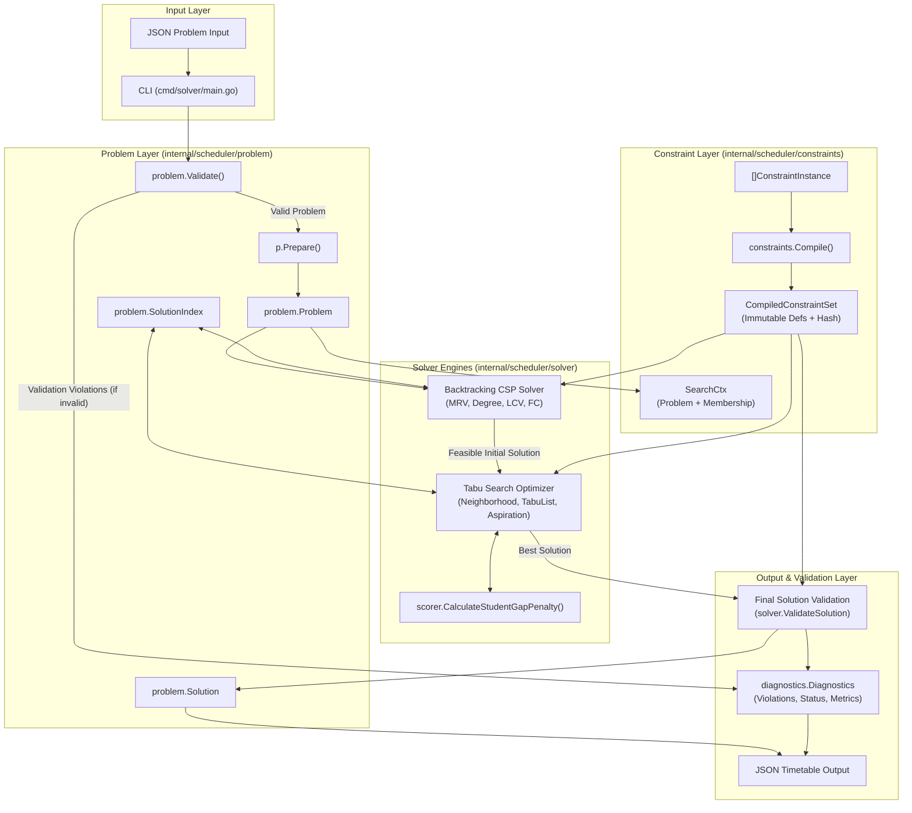
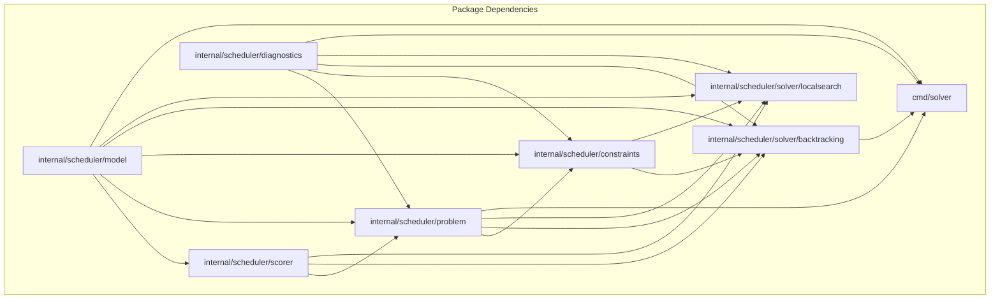

# CURA Timetable Scheduling Engine: Current State Architecture & System Design

**Document Version:** 1.0.0 (Current State Extraction)  
**Target Audience:** Independent System Architects / Reviewers  
**Source Repository:** `github.com/sPreetham42/timetable-platform`  
**Execution Environment:** Go 1.22+ on Windows/Linux/macOS  

---

## 1. Executive System Summary

### What CURA Is
CURA is an academic timetable scheduling engine written in standard Go. It takes a declarative description of academic scheduling requirements (departments, programs, classes, student groups, subjects, course offerings, session requirements, faculty, rooms, room features, time slots, availabilities, and locked assignments) and generates a conflict-free, gap-minimized timetable.

### Problem Solved
University and institutional scheduling requires satisfying strict physical and administrative hard constraints (e.g., room capacity, room equipment, faculty conflicts, room double-booking, faculty/room availability, student group time overlaps, and subject daily distribution limits) while optimizing soft operational objectives (currently minimizing student idle gaps between sessions).

### Current Technology
- **Language:** Go (`go.mod`: `module github.com/sPreetham42/timetable-platform`).
- **Standard Library Only:** Zero external runtime dependencies; uses Go standard library (`crypto/sha256`, `encoding/json`, `context`, `errors`, `math/rand`, `sort`, `time`).
- **In-Memory Operational Model:** In-memory graph of domain entities, indexed lookups via hash maps, depth-first backtracking search, and randomized-neighborhood tabu search.

### Current Solving Pipeline
The end-to-end execution pipeline operates in three sequential phases:

```
[ Problem Input ]
       │
       ▼
1. Structural Problem Validation (`problem.Validate(p)`)
       │
       ▼
2. Problem Preparation & Indexing (`p.Prepare()`)
       │
       ▼
3. Declarative Constraint Compilation (`constraints.Compile(&p, instances)`)
       │
       ▼
4. CSP Backtracking Search (`backtracking.Solver.Solve`)
       │  ├─ Seed Locked Assignments
       │  ├─ MRV + Degree Variable Selection
       │  ├─ LCV Value Ordering
       │  ├─ Forward Checking Domain Pruning
       │  └─ Reversible State Mutation / Rollback
       │
       ▼ [ Feasible Baseline Timetable (0 Hard Violations) ]
5. Tabu Local Search Optimization (`localsearch.TabuSearcher.Search`)
       │  ├─ Single Moves & 2-Way Swaps
       │  ├─ O(1) Reversible Move/Swap Mutations
       │  ├─ Scoped Hard Constraint Validation
       │  ├─ Tabu Tenure & Aspiration Criteria
       │  └─ Soft Score Minimization (Student Gap Penalty)
       │
       ▼ [ Optimized Best Solution ]
6. Final Complete-Solution Validation (`solver.ValidateSolution` / `finalizeSolution`)
       │  └─ Full evaluate pass over all compiled hard constraints
       │
       ▼
[ Validated Timetable Solution + Diagnostics ]
```

### Architectural Boundaries
1. **Domain Model (`internal/scheduler/model`)**: Pure data entities and identifiers.
2. **Problem & Solution (`internal/scheduler/problem`)**: Problem graph, preparation indexes, solution state, in-memory `SolutionIndex`, locked assignments, and in-place move/swap mutation/rollback.
3. **Declarative Constraint Framework (`internal/scheduler/constraints`)**: Immutable compiled constraint definitions (`ConstraintDef`), declarative constraint instances (`ConstraintInstance`), parameter validation, canonical SHA-256 rule hashing, and single-source-of-truth semantic evaluations.
4. **Scorer (`internal/scheduler/scorer`)**: Soft penalty calculation (`CalculateStudentGapPenalty`) and score breakdowns.
5. **Solvers (`internal/scheduler/solver`)**:
   - `solver/backtracking`: CSP solver with heuristics and forward checking.
   - `solver/localsearch`: Tabu search with neighborhood exploration and aspiration.
6. **Diagnostics (`internal/scheduler/diagnostics`)**: Explainability models, violation structures, solve statuses, and performance counters.
7. **CLI (`cmd/solver`)**: Standalone binary entry point reading JSON problem files from stdin or files and emitting JSON solutions and diagnostics.

---

## 2. High-Level Architecture



### Data Flow Descriptions
1. **JSON $\rightarrow$ CLI**: Unmarshaled into `problem.Problem` struct.
2. **`problem.Problem` $\rightarrow$ `problem.Validate()`**: Checked for schema integrity, missing foreign keys, negative numbers, and duplicate identifiers. Returns `[]diagnostics.Violation`.
3. **`problem.Problem` $\rightarrow$ `p.Prepare()`**: Builds derived lookup maps (`SlotsByDayPeriod`, `FacultyAvailable`, `RoomAvailable`, `StudentGroupOverlaps`).
4. **`[]ConstraintInstance` $\rightarrow$ `constraints.Compile()`**: Validates rule instance parameters, checks problem references, computes SHA-256 `RuleSetHash`, and creates immutable `ConstraintDef` evaluators.
5. **`CompiledConstraintSet` + `Problem` $\rightarrow$ CSP Solver**: Seeds locked assignments into `Solution.Index`, computes variable domains, searches feasible slot/room assignments using MRV/Degree/LCV/Forward Checking, and enforces compiled hard constraints.
6. **CSP Feasible Solution $\rightarrow$ Tabu Search**: Explores 1-move and 2-swap neighborhoods, evaluates move feasibility against compiled hard constraints via `ViolatedByMove`, updates the `TabuList`, and tracks the lowest `StudentGapPenalty`.
7. **Best Solution $\rightarrow$ Final Validation**: Re-runs all compiled hard constraint `Evaluate` methods across all solution assignments to guarantee zero hard violations.
8. **Solution + Diagnostics $\rightarrow$ Output**: Emits structured JSON containing assignments, scores, violations, and solver metrics.

---

## 3. Repository / Package Architecture

```
c:\Users\Preetham S\timetable-platform\
├── cmd\
│   └── solver\
│       └── main.go                    # CLI entry point, flag parsing, file I/O
├── internal\
│   └── scheduler\
│       ├── model\                     # Domain entity definitions and ID types
│       │   ├── ids.go                 # Strongly-typed identifier aliases (string)
│       │   ├── entities.go            # Core academic entities
│       │   └── timeslot.go            # TimeSlot and SlotKey definitions
│       ├── problem\                   # Scheduling instance, validation, solution & index
│       │   ├── assignment.go          # Assignment and AssignmentID
│       │   ├── errors.go              # Standard package sentinel errors
│       │   ├── move.go                # Placement, Move, Apply/Undo Move & Swap
│       │   ├── options.go             # SolveOptions and search mode constants
│       │   ├── problem.go             # Problem struct, Prepare(), derived lookups
│       │   ├── solution.go            # Solution, SolutionIndex, O(1) occupancy maps
│       │   └── validation.go          # Pre-search structural Problem validator
│       ├── constraints\               # Declarative constraint system & implementations
│       │   ├── constraints.go         # Legacy interfaces & helper functions
│       │   ├── framework.go           # ConstraintInstance, Compile(), ConstraintDef
│       │   ├── membership.go          # HierarchyMembershipIndex & MemberSet
│       │   ├── faculty_availability.go# Faculty availability rule
│       │   ├── faculty_conflict.go    # Faculty double-booking rule
│       │   ├── room_availability.go   # Room availability rule
│       │   ├── room_capacity.go       # Room size vs group size rule
│       │   ├── room_conflict.go       # Room double-booking rule
│       │   ├── room_feature_compatibility.go # Room equipment requirement rule
│       │   ├── student_group_conflict.go     # Student group overlap rule
│       │   └── subject_max_per_day.go # Max sessions per day rule
│       ├── scorer\                    # Objective evaluation & soft penalties
│       │   └── score.go               # Score, ScoreBreakdown, StudentGapPenalty
│       ├── diagnostics\               # Solver metrics, violations, status codes
│       │   └── diagnostics.go         # Violation, Diagnostics, SolveStatus, Severity
│       └── solver\                    # Solver interfaces and implementations
│           ├── solver.go              # Solver interface definition
│           ├── backtracking\          # CSP backtracking search engine
│           │   └── backtracking.go    # MRV, Degree, LCV, FC search algorithm
│           └── localsearch\           # Tabu search optimization engine
│               ├── candidate.go       # CandidateMove (single/swap), signatures
│               ├── evaluator.go       # EvaluateMove, FullScoreEvaluator
│               ├── neighborhood.go    # NeighborhoodGenerator
│               ├── tabu_list.go       # TabuList tenure & expiration tracking
│               ├── tabu_search.go     # Tabu search loop & aspiration logic
│               └── validator.go       # MoveValidator (scoped & compiled)
├── tests\                             # End-to-end, integration, parity, and benchmark suites
│   ├── backtracking_solver_test.go
│   ├── configurable_constraints_test.go
│   ├── localsearch_test.go
│   ├── locked_assignments_test.go
│   ├── membership_index_test.go
│   ├── randomized_invariant_test.go
│   ├── scorer_test.go
│   ├── tabu_search_bench_test.go
│   └── tabu_search_test.go
├── docs\                              # Architectural documentation
├── go.mod                             # Module definition
├── LICENSE                            # MIT license
└── README.md                          # Repository overview
```

### Package Responsibilities & Dependency Boundaries
- **`model`**: Leaf package. Depends on standard `time`. Defines raw data records and string-based type aliases.
- **`diagnostics`**: Leaf package. Defines `Violation`, `Severity`, `SolveStatus`, and `Diagnostics`.
- **`scorer`**: Depends on `model`. Computes gap penalties from occupied periods.
- **`problem`**: Depends on `model`, `diagnostics`, `scorer`. Owns problem definitions, pre-search validation, solution state, and in-memory indexing.
- **`constraints`**: Depends on `model`, `problem`, `diagnostics`. Owns constraint definitions, compilation, and semantic validation.
- **`solver/backtracking`**: Depends on `model`, `problem`, `constraints`, `scorer`, `diagnostics`. Implements CSP solving.
- **`solver/localsearch`**: Depends on `model`, `problem`, `constraints`, `scorer`, `diagnostics`. Implements Tabu Search optimization.
- **`cmd/solver`**: Application entry point. Depends on `model`, `problem`, `diagnostics`, `solver/backtracking`.

---

## 4. Domain Model

### Entities & Relationships

| Entity | ID Type | Key Fields | Relationships |
|---|---|---|---|
| **Department** | `model.DepartmentID` | `ID`, `TenantID`, `Name` | Belongs to `Tenant`. Contains `Programs`. |
| **Program** | `model.ProgramID` | `ID`, `DepartmentID`, `Name` | Belongs to `Department`. Contains `Classes`. |
| **Class** | `model.ClassID` | `ID`, `ProgramID`, `Name`, `WholeGroupID`, `StudentGroupIDs` | Belongs to `Program`. Contains whole cohort group and subgroups. |
| **StudentGroup** | `model.StudentGroupID` | `ID`, `ClassID`, `Name`, `Size` | Belongs to `Class`. Represents whole class or lab subgroup. |
| **Subject** | `model.SubjectID` | `ID`, `Code`, `Name` | Academic subject/course definition. |
| **CourseOffering** | `model.CourseOfferingID` | `ID`, `TermID`, `ClassID`, `SubjectID`, `StudentGroupID`, `FacultyID`, `RequiredRoomFeatureIDs`, `SessionRequirementIDs` | Joins `Term`, `Class`, `Subject`, `StudentGroup`, `Faculty`, and requirements. |
| **SessionRequirement** | `model.SessionRequirementID`| `ID`, `CourseOfferingID`, `Type` (`THEORY`/`LAB`), `SessionsPerWeek`, `Duration`, `Consecutive`, `RequiredRoomFeatureIDs` | Specifies weekly sessions, period duration, and feature requirements. |
| **Faculty** | `model.FacultyID` | `ID`, `Name` | Instructors assigned to course offerings. |
| **RoomFeature** | `model.RoomFeatureID` | `ID`, `Name` | Equipment/feature tags (e.g. Lab, Projector). |
| **Room** | `model.RoomID` | `ID`, `Name`, `Capacity`, `FeatureIDs` | Physical room with capacity and feature tags. |
| **TimeSlot** | `model.TimeSlotID` | `ID`, `Day` (`time.Weekday`), `Period` (`int`), `Label` | Recurring weekly period slot on a given weekday. |
| **FacultyAvailability**| N/A | `FacultyID`, `TimeSlotID` | Explicit allowable slot for a faculty member. |
| **FacultyPreference**  | N/A | `FacultyID`, `TimeSlotID`, `Weight` | Slot preference weighting (currently parsed/validated). |
| **RoomAvailability**   | N/A | `RoomID`, `TimeSlotID` | Explicit allowable slot for a room. |
| **Term** | `model.TermID` | `ID`, `TenantID`, `Name` | Academic term / semester window. |
| **Assignment** | `problem.AssignmentID` | `ID`, `CourseOfferingID`, `StudentGroupID`, `FacultyID`, `RoomID`, `TimeSlotID`, `SessionRequirementID`, `Instance` | An individual scheduled session instance. |

### StudentGroup Hierarchy Representation
In the current code (`internal/scheduler/model/entities.go` and `internal/scheduler/problem/problem.go`):
1. **Class-Centric Structure**: A `Class` declares `WholeGroupID` (the root cohort) and a slice `StudentGroupIDs []StudentGroupID` (which includes `WholeGroupID` and its subgroups, e.g., `Lab 1`, `Lab 2`).
2. **Two-Level Tree Semantics**:
   - `WholeGroupID` overlaps with itself and every subgroup in `StudentGroupIDs`.
   - Each subgroup overlaps with itself and `WholeGroupID`.
   - Subgroups within the same class are disjoint with each other.
   - Student groups from different classes are disjoint.
3. **No Bitsets or LeafSet Trees**: The repository does **not** use bitsets, leaf set masks, or N-ary tree pointers. Hierarchy is statically mapped into a symmetric lookup map `Problem.StudentGroupOverlaps` during `p.Prepare()`.

---

## 5. Problem Preparation (`Problem.Prepare()`)

`Problem.Prepare()` initializes all derived precomputed index structures on the `Problem` instance before search or compilation begins:

```go
func (p *Problem) Prepare() {
    p.BuildSlotIndex()
    p.BuildAvailabilityIndexes()
    p.BuildStudentGroupOverlaps()
}
```

### Derived Structures Built
1. **`SlotsByDayPeriod` (`map[model.SlotKey]model.TimeSlotID`)**:
   - Key: `SlotKey{Day: time.Weekday, Period: int}`.
   - Value: `model.TimeSlotID`.
   - Purpose: $O(1)$ consecutive slot resolution in `p.OccupiedSlotIDs(startSlot, duration)`.
2. **`FacultyAvailable` (`map[model.FacultyID]map[model.TimeSlotID]struct{}`)**:
   - Populated from `FacultyAvailabilities` slice if not already set.
   - Purpose: $O(1)$ faculty allowable slot lookups in `p.IsFacultyAvailable(facultyID, slotIDs)`.
3. **`RoomAvailable` (`map[model.RoomID]map[model.TimeSlotID]struct{}`)**:
   - Populated from `RoomAvailabilities` slice if not already set.
   - Purpose: $O(1)$ room allowable slot lookups in `p.IsRoomAvailable(roomID, slotIDs)`.
4. **`StudentGroupOverlaps` (`map[model.StudentGroupID]map[model.StudentGroupID]struct{}`)**:
   - Populated by mapping each group to itself, and each `WholeGroupID` to all its listed `StudentGroupIDs`.
   - Purpose: $O(1)$ overlap checks via `p.StudentGroupsOverlap(g1, g2)` and $O(k)$ retrieval via `p.OverlappingStudentGroupIDs(g)`.

### Mutability & State Invariants
- **Immutable After Preparation**: All fields on `problem.Problem` (catalogs, requirements, derived maps, `LockedAssignments`) are treated as **read-only and immutable** during the entire CSP and Tabu Search execution.
- **Mutable State**: Contained entirely inside `problem.Solution` (`Assignments` slice and `SolutionIndex`).

---

## 6. Solution Representation

### State Architecture

```
problem.Solution
├── Assignments: []Assignment (Authoritative sequential state)
├── Index: SolutionIndex (O(1) derived runtime occupancy index)
└── Score: scorer.Score (Cached evaluation breakdown)
```

- **Authoritative State**: `Solution.Assignments` slice.
- **Derived / Indexed State**: `Solution.Index` (hash tables for faculty, room, and student group occupancies).
- **Deep Copy**: `solution.Clone()` creates an independent copy of `Assignments` and shallow copies of all index map entries.

### Mutation & Rollback Operations

| Operation | Implementation | Behavior | Rollback Partner |
|---|---|---|---|
| **Add Assignment** | `Solution.AddAssignment(p, a)` | Checks `Index.Add(p, a)`; if valid, updates index maps and appends to `Assignments`. | `Solution.RemoveLastAssignment(p)` |
| **Remove Last** | `Solution.RemoveLastAssignment(p)` | Pops last assignment from `Assignments` and calls `Index.Remove(p, last)`. | Re-add assignment |
| **Apply Move** | `Solution.ApplyMove(p, move)` | Removes current assignment from index, updates `RoomID`/`TimeSlotID`, updates `Assignments[idx]`, and re-indexes at new placement. | `Solution.UndoMove(p, move)` |
| **Undo Move** | `Solution.UndoMove(p, move)` | Unindexes updated placement, restores `move.From` placement, updates `Assignments[idx]`, and re-indexes at original placement. | `Solution.ApplyMove(p, move)` |
| **Apply Swap** | `Solution.ApplySwap(p, m1, m2)` | Unindexes both assignments, swaps their placements, updates `Assignments[idx1]` and `Assignments[idx2]`, and re-indexes both. | `Solution.UndoSwap(p, m1, m2)` |
| **Undo Swap** | `Solution.UndoSwap(p, m1, m2)` | Unindexes both assignments, restores original placements, and re-indexes both. | `Solution.ApplySwap(p, m1, m2)` |

---

## 7. SolutionIndex

`SolutionIndex` maintains in-memory lookup maps for $O(1)$ resource conflict detection and requirement instance counts.

```go
type SolutionIndex struct {
    FacultySlot      map[resourceSlotKey]AssignmentID
    RoomSlot         map[resourceSlotKey]AssignmentID
    StudentGroupSlot map[resourceSlotKey]AssignmentID
    RequirementCount map[model.SessionRequirementID]int
    byID             map[AssignmentID]Assignment
}

type resourceSlotKey struct {
    Resource string
    Slot     model.TimeSlotID
}
```

### Internal Index Structures

| Index | Key | Value | Purpose | Complexity |
|---|---|---|---|---|
| **`FacultySlot`** | `{Resource: FacultyID, Slot: TimeSlotID}` | `AssignmentID` | Detects faculty double-booking. | $O(1)$ lookup / write |
| **`RoomSlot`** | `{Resource: RoomID, Slot: TimeSlotID}` | `AssignmentID` | Detects room double-booking. | $O(1)$ lookup / write |
| **`StudentGroupSlot`** | `{Resource: StudentGroupID, Slot: TimeSlotID}` | `AssignmentID` | Detects group scheduling at slot. | $O(1)$ lookup / write |
| **`RequirementCount`**| `SessionRequirementID` | `int` | Tracks scheduled count per requirement. | $O(1)$ lookup / increment |
| **`byID`** | `AssignmentID` | `Assignment` | Fast lookup of assignment record by ID. | $O(1)$ lookup |

### Architectural Boundary Rule
`SolutionIndex` **only owns runtime resource occupancy state**. It does **not** contain constraint semantics, hierarchy resolution logic, or violation message generators. Constraint semantics reside strictly in compiled `ConstraintDef` implementations.

---

## 8. Constraint Framework

### Core Types & Lifecycle

```
ConstraintInstance (Declarative JSON/Struct)
       │
       ▼ [ validateInstance() - Syntax & Problem Catalog Cross-Check ]
       ▼ [ Canonical JSON Serialization + SHA-256 Sum ]
Compile(&p, instances) ──► CompiledConstraintSet (Immutable) + RuleSetHash
       │
       ├─► Hard []ConstraintDef (Evaluated in CSP & Tabu & Final Validation)
       └─► Soft []ConstraintDef (Prepared for soft rule pipelines)
```

### Key Interfaces

```go
type ConstraintDef interface {
    ID() string
    Kind() ConstraintKind // "HARD" | "SOFT"
    IsConsistent(ctx *SearchCtx, partial *problem.Solution, candidate problem.Assignment) bool
    ViolatedByMove(ctx *SearchCtx, sol *problem.Solution, mv problem.Move) []diagnostics.Violation
    Evaluate(ctx *SearchCtx, sol *problem.Solution) []diagnostics.Violation
}

type SearchCtx struct {
    Problem    *problem.Problem
    Membership MembershipIndex
}
```

### Compilation & Hash Determinism
- `Compile(p *problem.Problem, instances []ConstraintInstance) (*CompiledConstraintSet, string, []CompileError)`
- Sorts instances deterministically by `(ID, TemplateID)`.
- Marshals canonical JSON and generates SHA-256 hex string (`RuleSetHash`).
- Performs parameter parsing and type validation; if `p != nil`, verifies referenced IDs against `p` catalogs.
- Returns `CompileErrors` on validation failures without compiling partial sets.

---

## 9. All Current Hard Constraints

Every built-in hard constraint in CURA is fully migrated to the declarative compiled framework, implements `ConstraintDef`, and routes all evaluation surfaces (`IsConsistent`, `ViolatedByMove`, `Evaluate`, `Check`, `CheckAtSlot`) to a single core internal semantic decision function.

### 1. SubjectMaxPerDay
- **TemplateID**: `"SubjectMaxPerDay"`
- **Scope / Parameters**: `subjectId` (optional), `courseOfferingId` (optional), `maxPerDay` (int, default 1). Scope: `global` / `department` / `class`.
- **Semantic Rule**: For a given student group, the number of scheduled sessions matching the subject/course offering on any single weekday cannot exceed `maxPerDay`.
- **Core Function**: `countOnDay(ctx, sol, groupID, day, ignoreID) int`
- **Surfaces**:
  - `IsConsistent`: Checks if adding candidate to partial solution keeps `countOnDay + 1 <= maxPerDay`.
  - `ViolatedByMove`: Evaluates count on move's target day after applying move.
  - `Evaluate`: Scans all solution assignments grouped by `(GroupID, Day)`.

### 2. FacultyConflict
- **TemplateID**: `"FacultyConflict"`
- **Scope / Parameters**: Global binary conflict rule. No extra parameters required.
- **Semantic Rule**: A faculty member cannot be scheduled for multiple sessions occupying the same recurring time slot.
- **Core Function**: `checkAssignment(p, sol, a) (problem.AssignmentID, bool)`
- **Surfaces**:
  - `IsConsistent`: Checks `sol.Index.FacultyConflict(candidate.FacultyID, slotIDs)`.
  - `ViolatedByMove`: Checks `sol.Index.FacultyConflict(candidate.FacultyID, newSlotIDs) != mv.AssignmentID`.
  - `Evaluate`: Evaluates all assignments via `checkAssignment` and deduplicates pairs.

### 3. RoomConflict
- **TemplateID**: `"RoomConflict"`
- **Scope / Parameters**: Global binary conflict rule. No extra parameters required.
- **Semantic Rule**: A room cannot be scheduled for multiple sessions occupying the same recurring time slot.
- **Core Function**: `checkAssignment(p, sol, a) (problem.AssignmentID, bool)`
- **Surfaces**:
  - `IsConsistent`: Checks `sol.Index.RoomConflict(candidate.RoomID, slotIDs)`.
  - `ViolatedByMove`: Checks `sol.Index.RoomConflict(candidate.RoomID, newSlotIDs) != mv.AssignmentID`.
  - `Evaluate`: Evaluates all assignments via `checkAssignment` and deduplicates pairs.

### 4. RoomCapacity
- **TemplateID**: `"RoomCapacity"`
- **Scope / Parameters**: Global unary capacity rule. No extra parameters required.
- **Semantic Rule**: The assigned room capacity must be greater than or equal to the student group size (`room.Capacity >= group.Size`).
- **Core Function**: `checkAssignment(p, a) (roomCapacity, groupSize int, violationType string, bool)`
- **Surfaces**:
  - `IsConsistent`: Returns `true` if `room.Capacity >= group.Size`.
  - `ViolatedByMove`: Evaluates candidate assignment at `mv.To.RoomID`.
  - `Evaluate`: Scans all solution assignments.

### 5. RoomFeatureCompatibility
- **TemplateID**: `"RoomFeatureCompatibility"`
- **Scope / Parameters**: Global unary compatibility rule. No extra parameters required.
- **Semantic Rule**: The assigned room must provide all required features declared by the course offering and session requirement (`RoomHasFeatures(room.ID, required)`).
- **Core Function**: `checkAssignment(p, a) ([]model.RoomFeatureID, bool)`
- **Surfaces**:
  - `IsConsistent`: Returns `true` if room contains all required room feature IDs.
  - `ViolatedByMove`: Evaluates candidate assignment at `mv.To.RoomID`.
  - `Evaluate`: Scans all solution assignments.

### 6. FacultyAvailability
- **TemplateID**: `"FacultyAvailability"`
- **Scope / Parameters**: Global unary availability rule. No extra parameters required.
- **Semantic Rule**: Faculty member must be explicitly marked available for all time slots occupied by the session (`p.IsFacultyAvailable(facultyID, slotIDs)`).
- **Core Function**: `checkAssignment(p, a) (slotIDs []model.TimeSlotID, ok bool, isAvail bool)`
- **Surfaces**:
  - `IsConsistent`: Checks `p.IsFacultyAvailable(candidate.FacultyID, candidateSlotIDs)`.
  - `ViolatedByMove`: Evaluates candidate assignment at `mv.To.TimeSlotID`.
  - `Evaluate`: Scans all solution assignments.

### 7. RoomAvailability
- **TemplateID**: `"RoomAvailability"`
- **Scope / Parameters**: Global unary availability rule. No extra parameters required.
- **Semantic Rule**: Room must be explicitly marked available for all time slots occupied by the session (`p.IsRoomAvailable(roomID, slotIDs)`).
- **Core Function**: `checkAssignment(p, a) (slotIDs []model.TimeSlotID, ok bool, isAvail bool)`
- **Surfaces**:
  - `IsConsistent`: Checks `p.IsRoomAvailable(candidate.RoomID, candidateSlotIDs)`.
  - `ViolatedByMove`: Evaluates candidate assignment at `mv.To.TimeSlotID`.
  - `Evaluate`: Scans all solution assignments.

### 8. StudentGroupConflict
- **TemplateID**: `"StudentGroupConflict"`
- **Scope / Parameters**: Global hierarchy conflict rule. No extra parameters required.
- **Semantic Rule**: Two sessions conflict if and only if their occupied time slots overlap AND they share at least one student (determined by group hierarchy overlaps).
- **Core Function**: `checkAssignment(p, sol, a) (problem.AssignmentID, model.StudentGroupID, bool)`
- **Surfaces**:
  - `IsConsistent`: Checks all overlapping groups against `sol.Index.StudentGroupConflict(groupID, slotIDs)`.
  - `ViolatedByMove`: Checks candidate assignment at new slot against overlapping groups.
  - `Evaluate`: Scans all solution assignments and deduplicates conflicting pairs.

---

## 10. StudentGroupConflict — Detailed Architecture

### Overlap Preprocessing
During `p.Prepare()`, `p.BuildStudentGroupOverlaps()` initializes `p.StudentGroupOverlaps`:
1. Every student group overlaps with itself: $(g_i, g_i) \in \text{Overlaps}$.
2. For each class $C$, the whole cohort group $W = C.\text{WholeGroupID}$ overlaps with all subgroups $S_k \in C.\text{StudentGroupIDs}$:
   $$(W, S_k) \in \text{Overlaps} \quad \text{and} \quad (S_k, W) \in \text{Overlaps}$$
3. Distinct subgroups under the same class $S_a \neq S_b$ do **not** overlap (treated as disjoint student sets).
4. Subgroups from different classes do **not** overlap.

### Runtime Conflict Detection
When evaluating an assignment $A$ with student group $G_A$ occupying slots $T$:
1. Retrieve precomputed overlapping group IDs: `overlapping := p.OverlappingStudentGroupIDs(G_A)`.
2. For each overlapping group ID $G_{\text{ov}} \in \text{overlapping}$:
   - Query runtime index: `conflictingID, exists := solution.Index.StudentGroupConflict(G_ov, T)`.
   - If `exists` and `conflictingID != A.ID`, a hard conflict is identified with `conflictingID` on overlapping group $G_{\text{ov}}$.

### Hierarchy Test Coverage
The suite covers:
- Parent vs. Child (Whole Group vs. Lab Subgroup): **Conflict**.
- Sibling vs. Sibling (Lab 1 vs. Lab 2 in same class): **No Conflict**.
- Disjoint Classes (Class A vs. Class B): **No Conflict**.
- Multi-period boundary overlaps: **Conflict**.
- Off-grid durations: **Invalid Duration Violation**.

---

## 11. CSP Solver (`internal/scheduler/solver/backtracking`)

### Search Architecture

```
buildDecisions(&p) ──► List of unassigned session variables
         │
         ▼
buildInitialDomains() ──► Filter unary valid (Room, Slot) candidates
         │
         ▼
searchHeuristic() Loop:
  1. Check termination (context cancellation, max nodes limit)
  2. Select Variable: selectMRVDegree() (Minimum Remaining Values, tie-break by Degree)
  3. Order Values: orderLCV() (Least Constraining Value via countEliminations)
  4. For each value:
       a. Check constraints.CheckAll()
       b. Check compiled Hard.IsConsistent()
       c. solution.AddAssignment(p, assignment)
       d. Forward Checking: pruneDomains() (prune other unassigned variable domains)
       e. If all remaining domains viable: Recurse
       f. solution.RemoveLastAssignment(p) [Rollback]
```

### Heuristics Implemented
1. **MRV (Minimum Remaining Values)**: Selects unassigned decision variable with smallest candidate domain size.
2. **Degree Heuristic**: Breaks MRV ties by choosing the variable sharing the most faculty and student group overlaps with remaining unassigned decisions.
3. **LCV (Least Constraining Value)**: Orders candidate placements by counting how many domain options they eliminate from neighboring unassigned variables.
4. **Forward Checking**: `pruneDomains()` temporarily removes incompatible placements from unassigned variables after each assignment; triggers backtrack immediately if any domain becomes empty.

### Locked Assignments Handling
Pre-assigned sessions in `Problem.LockedAssignments` are validated and seeded into `Solution.Index` during solver initialization before decision variable generation. Locked assignments are excluded from the decision list and remain permanently fixed throughout the search.

---

## 12. Tabu Search Optimizer (`internal/scheduler/solver/localsearch`)

### Local Search Architecture

```
Initial Feasible Solution (from CSP)
         │
         ▼
TabuSearcher.Search() Loop:
  1. Check termination (MaxIterations, MaxDuration, NoImprovementLimit, Context)
  2. Generate Neighborhood: NeighborhoodGenerator.GenerateNeighbors()
       - Unlocked single moves (Assignment -> new Room/Slot)
       - Unlocked 2-way swaps (Assignment1 <-> Assignment2 placements)
  3. Evaluate Candidates in Parallel/Sequence:
       - ApplyCandidateMove()
       - Scoped & Compiled MoveValidator.Validate() (Hard constraints)
       - FullScoreEvaluator.Evaluate() (StudentGapPenalty)
       - UndoCandidateMove() [Protected by defer]
  4. Tabu List & Aspiration:
       - If move signature is tabu: Reject UNLESS score < global bestScore (Aspiration)
  5. Select Best Admissible Candidate:
       - Apply move permanently to current solution
       - Record reverse move signature in TabuList with tenure expiration
       - Update global best if score improved
```

### Move Representations & Signatures
- **Single Move Signature**: `MOVE|assignmentId|fromRoom:fromSlot|toRoom:toSlot`
  - Reverse: `MOVE|assignmentId|toRoom:toSlot|fromRoom:fromSlot`
- **Swap Move Signature**: Canonicalized by smaller AssignmentID:
  `SWAP|a1(from1->to1)|a2(from2->to2)`
  - Reverse: `SWAP|a1(to1->from1)|a2(to2->from2)`

### Tabu Tenure & Termination Parameters
- `TabuTenure`: Default 10 iterations.
- `MaxIterations`: Default 1000 iterations.
- `NoImprovementLimit` (Stagnation): Default 100 iterations without global best score improvement.
- `MaxCandidates`: Default 100 candidate moves sampled per iteration.
- `MaxDuration`: Optional timeout threshold.

---

## 13. Scoring / Objectives (`internal/scheduler/scorer`)

### Current Objective Implementation
The system currently implements a **single soft objective**: minimizing student schedule gaps (`StudentGapPenalty`).

```go
type Score struct {
    HardViolations int            `json:"hardViolations"`
    SoftPenalty    int            `json:"softPenalty"`
    Breakdown      ScoreBreakdown `json:"breakdown,omitempty"`
}

type ScoreBreakdown struct {
    HardViolations    int                          `json:"hardViolations"`
    SoftPenalty       int                          `json:"softPenalty"`
    StudentGapPenalty int                          `json:"studentGapPenalty"`
    GroupGaps         map[model.StudentGroupID]int `json:"groupGaps,omitempty"`
    Details           []GroupDayGap                `json:"details,omitempty"`
}
```

### Calculation Algorithm (`CalculateStudentGapPenalty`)
For each student group and each weekday:
1. Identify all periods where the student group is scheduled.
2. If fewer than 2 periods are occupied, gap penalty is $0$.
3. Sort occupied periods: $p_{\text{first}} = \min(P), p_{\text{last}} = \max(P)$.
4. Count all unoccupied periods strictly between $p_{\text{first}}$ and $p_{\text{last}}$:
   $$\text{Gaps} = \sum_{p = p_{\text{first}} + 1}^{p_{\text{last}} - 1} \mathbf{1}_{p \notin P}$$
5. Leading and trailing free periods (before the first class or after the last class of the day) are ignored.
6. Total `SoftPenalty` is the sum of gaps across all student groups and weekdays.

### Current Objective Status
- **Weights**: Not currently parameterized in scoring (each gap costs 1 unit).
- **Multiple Objectives**: Only `StudentGapPenalty` is computed. Faculty preferences and subject distribution soft penalties are parsed in the schema but not yet active in the objective function.
- **Evaluation Mode**: Full recomputation (`FullScoreEvaluator`).

---

## 14. Validation Architecture

Validation in CURA is organized into distinct, layered gates:

| Validation Layer | Component / Method | Scope & Responsibility |
|---|---|---|
| **1. Structural Problem Validation** | `problem.Validate(p)` | Validates problem catalog, foreign key references, positive periods/durations/capacities, non-empty IDs, and locked assignment references before solving. |
| **2. Constraint Instance Validation** | `constraints.Compile(p, instances)` | Validates constraint instance schema, parameter types/bounds, and checks referenced subject/offering/faculty/room IDs against problem catalog. |
| **3. Candidate Assignment Validation** | `constraints.CheckAll()` & `ConstraintDef.IsConsistent()` | Evaluates candidate placements against partial solutions during CSP search and forward checking. |
| **4. Local Search Move Validation** | `localsearch.MoveValidator` & `ConstraintDef.ViolatedByMove()` | Validates proposed moves or swaps against all scoped and compiled hard constraints. |
| **5. Final Solution Validation** | `solver.ValidateSolution` / `finalizeSolution` | Re-evaluates entire final solution against all compiled hard constraints to ensure zero hard violations. |
| **6. Differential Parity Testing** | `tests/configurable_constraints_test.go` | Compares compiled constraint results against frozen legacy oracles across randomized problem instances. |

---

## 15. Diagnostics & Observability (`internal/scheduler/diagnostics`)

```go
type Diagnostics struct {
    Status        SolveStatus `json:"status"`
    NodesExplored int         `json:"nodesExplored"`
    Candidates    int         `json:"candidates"`
    Backtracks    int         `json:"backtracks"`
    Violations    []Violation `json:"violations,omitempty"`
    Message       string      `json:"message,omitempty"`
}

type Violation struct {
    ConstraintName string            `json:"constraintName"`
    ConstraintID   string            `json:"constraintId,omitempty"`
    TemplateID     string            `json:"templateId,omitempty"`
    Scope          string            `json:"scope,omitempty"`
    Severity       Severity          `json:"severity"` // "HARD" | "SOFT" | "INFO"
    Message        string            `json:"message"`
    AssignmentID   string            `json:"assignmentId,omitempty"`
    RelatedIDs     map[string]string `json:"relatedIds,omitempty"`
    Metadata       map[string]string `json:"metadata,omitempty"`
}
```

### Metrics Collected
- `NodesExplored`: Number of search nodes visited during backtracking.
- `Candidates`: Number of assignment candidates evaluated.
- `Backtracks`: Number of search backtracks encountered.
- `Violations`: Bounded slice of detailed violation records explaining why solutions or moves failed.

---

## 16. Error & Status Model

### Standard Solver Statuses (`diagnostics.SolveStatus`)
- **`SOLVED` (`"SOLVED"`)**: Feasible timetable found with 0 hard violations.
- **`INFEASIBLE` (`"INFEASIBLE"`)**: Search exhausted with no feasible placement possible.
- **`INVALID_PROBLEM` (`"INVALID_PROBLEM"`)**: Input problem failed structural validation.
- **`NODE_LIMIT` (`"NODE_LIMIT"`)**: Search terminated upon reaching `options.MaxNodes`.
- **`CANCELLED` (`"CANCELLED"`)**: Context was cancelled during execution.
- **`DEADLINE_EXCEEDED` (`"DEADLINE_EXCEEDED"`)**: Context deadline expired during search.

### Standard Sentinel Errors
- **`problem` package**:
  - `ErrInvalidAssignment`: Assignment does not fit recurring day grid.
  - `ErrFacultyConflict`: Faculty double-booked at slot.
  - `ErrRoomConflict`: Room double-booked at slot.
  - `ErrGroupConflict`: Student group double-booked at slot.
  - `ErrLockedAssignment`: Cannot move or mutate a locked assignment.
  - `ErrAssignmentNotFound`: Assignment missing from solution index.
- **`backtracking` package**:
  - `ErrNoSolution`: No feasible timetable found.
  - `ErrNodeLimit`: Search node limit reached.
  - `ErrInvalidProblem`: Invalid scheduling problem.
- **`localsearch` package**:
  - `ErrInitialSolutionInfeasible`: Initial solution violates hard constraints.
- **`constraints` package**:
  - `CompileError` / `CompileErrors`: Structured constraint compilation errors.

---

## 17. CLI / External Boundary (`cmd/solver/main.go`)

### Invocation & Flags
```bash
go run ./cmd/solver -input <path-to-problem.json> -max-nodes 100000
```
- `-input`: Path to JSON-encoded scheduling problem. If empty, runs on a built-in sample problem.
- `-max-nodes`: Integer node limit for backtracking search (default 100,000).

### I/O Serialization
- **Standard Input / File**: Decodes `problem.Problem` JSON object.
- **Standard Output**: Encodes structured JSON:
```json
{
  "solution": {
    "assignments": [...],
    "score": {
      "hardViolations": 0,
      "softPenalty": 2,
      "breakdown": { ... }
    }
  },
  "diagnostics": {
    "status": "SOLVED",
    "nodesExplored": 42,
    "candidates": 128,
    "backtracks": 0,
    "message": "feasible timetable found"
  }
}
```
- **Exit Codes**:
  - `0`: Success / Feasible solution found.
  - `1`: Solve failure (Infeasible, timeout, node limit).
  - `2`: Input file or JSON decoding error.

---

## 18. Testing Architecture

The codebase contains a comprehensive automated test suite covering unit behavior, integration, mathematical invariants, randomized property fuzzing, and differential parity against legacy behavior:

| Test Suite File | Focus Area | Key Verification Properties |
|---|---|---|
| **`configurable_constraints_test.go`** | Declarative constraints | Differential parity against frozen pre-migration oracles, 500-iteration random topology testing, SHA-256 rule hashing, scoped vs full evaluation parity, move delta parity, CSP integration, Tabu integration, final validation parity, benchmarks. |
| **`backtracking_solver_test.go`** | CSP Backtracking | Basic search, heuristic MRV/Degree/LCV/Forward Checking search, node limits, timeouts, cancellation, empty domains, locked assignment preservation. |
| **`tabu_search_test.go`** | Tabu Search Optimizer | Hard constraint preservation, locked assignment immutability, legal move scoring, illegal move rejection, tabu tenure enforcement, aspiration criteria, iteration/time limits, deterministic seeds. |
| **`locked_assignments_test.go`** | Locked Sessions | Pre-scheduled assignments, validation, exclusion from decision variables, immutability in local search, preservation in final solution. |
| **`membership_index_test.go`** | Student Groups | Group overlap resolution, hierarchy membership queries, cardinality, deterministic iteration. |
| **`randomized_invariant_test.go`** | Fuzzing & Invariants | Randomized valid timetable generation and invariant verification over multiple seed runs. |
| **`scorer_test.go`** | Soft Scoring | Student gap penalty calculation across 0-gap, 1-gap, multi-gap, multi-period, and multi-day configurations. |
| **`localsearch_test.go`** | Local Search Core | MoveValidator, FullScoreEvaluator, candidate move signatures, single/swap apply and undo parity. |
| **`tabu_search_bench_test.go`** | Benchmarks | Throughput and iteration performance of Tabu Search. |

### Test Suite Execution Status
```
PASS
ok  	github.com/sPreetham42/timetable-platform/tests	86.464s
```
*100% of tests pass across all packages with zero regressions.*

---

## 19. Performance Characteristics

### Complexity & Runtime Indexes
- **Occupancy Lookups**: $O(1)$ lookup and mutation via `SolutionIndex` maps (`FacultySlot`, `RoomSlot`, `StudentGroupSlot`).
- **Consecutive Slot Expansion**: $O(d)$ lookup via `Problem.SlotsByDayPeriod` map where $d$ is session duration.
- **Student Group Overlaps**: $O(1)$ overlap checks via `Problem.StudentGroupOverlaps` map; $O(k)$ retrieval via pre-sorted `p.OverlappingStudentGroupIDs`.
- **Constraint Move Evaluation (`ViolatedByMove`)**: $O(1)$ to $O(k)$ indexed lookup per move candidate without full solution re-scanning.
- **Scoring**: $O(A \log A)$ where $A$ is the number of scheduled assignments per student group/day.

### Observable Benchmark Results
From `tests/configurable_constraints_test.go` (12th Gen Intel Core i7-12650HX, Windows AMD64):

| Benchmark Name | Operations | Speed (ns/op) |
|---|---|---|
| `BenchmarkStudentGroupConflict_LegacyFullSolutionCheck` | 1,873,982 | 625.4 ns/op |
| `BenchmarkStudentGroupConflict_CompiledFullSolutionEvaluate` | 1,000,000 | 1,040 ns/op |
| `BenchmarkStudentGroupConflict_CompiledIsConsistent` | 1,491,225 | 934.1 ns/op |
| `BenchmarkStudentGroupConflict_CompiledViolatedByMove` | 1,000,000 | 1,269 ns/op |
| `BenchmarkRoomConflict_CompiledViolatedByMove` | 1,854,994 | 648.7 ns/op |
| `BenchmarkRoomCapacity_CompiledViolatedByMove` | 2,829,088 | 419.1 ns/op |

---

## 20. Dependency & Data Flow Diagram



**Circular Dependencies**: None. Dependency graph is strictly acyclic.

---

## 21. Current Architectural Invariants

The current implementation guarantees and relies upon the following structural invariants:

1. **`SOLVED` $\iff$ 0 Hard Violations**: A solver status of `SOLVED` is only emitted after `ValidateSolution` confirms zero hard constraint violations across all compiled rules.
2. **Locked Assignment Immutability**: Assignments in `Problem.LockedAssignments` cannot be moved, swapped, or omitted during search.
3. **State Mutation Invertibility**:
   $$\text{ApplyMove}(m) \circ \text{UndoMove}(m) \equiv \text{Identity}$$
   $$\text{ApplySwap}(m_1, m_2) \circ \text{UndoSwap}(m_1, m_2) \equiv \text{Identity}$$
4. **Compiled Constraint Immutability**: Once compiled via `constraints.Compile()`, a `CompiledConstraintSet` is read-only and thread-safe.
5. **Single Semantic Truth**: Each constraint rule delegates all evaluation surfaces (`IsConsistent`, `ViolatedByMove`, `Evaluate`, `Check`, `CheckAtSlot`) to a single internal decision function.
6. **`SolutionIndex` State Parity**: `Solution.Index` exactly mirrors `Solution.Assignments` at all times.

---

## 22. Current Architectural Risks

| Risk | Evidence in Code | Affected Component | Potential Consequence |
|---|---|---|---|
| **Memory Allocation in Heuristic LCV Ranking** | `countEliminations` in `backtracking.go` adds/removes assignments and re-evaluates all domains for every candidate. | `solver/backtracking` | On large instances with many variables and dense domains, LCV ranking may become CPU/memory-bound. |
| **Full Score Recomputation in Tabu Loop** | `FullScoreEvaluator.Evaluate` recalculates student gap penalties across all groups and days for every evaluated candidate move. | `solver/localsearch` | Evaluating hundreds of candidate moves per iteration recomputes unaffected group schedules. |
| **Two-Level Student Group Assumption** | `p.BuildStudentGroupOverlaps()` computes overlaps assuming `WholeGroupID` and one slice of child `StudentGroupIDs`. | `problem.BuildStudentGroupOverlaps` | Multi-tier hierarchies (e.g. Cohort $\rightarrow$ Section $\rightarrow$ Lab Group) are flattened to parent-child pairs without arbitrary multi-level tree ancestor resolution. |
| **In-Memory Problem Size Bounds** | All entities and domain matrices are stored in standard Go map structures in memory. | `problem.Problem` | Extremely large institutions (e.g. $>50,000$ weekly session requirements) may experience significant memory pressure without disk pagination. |

---

## 23. Current vs Planned

| Area | Current Implementation | Planned / Future Idea |
|---|---|---|
| **Hard Constraints** | 8 fully compiled declarative constraints (`SubjectMaxPerDay`, `FacultyConflict`, `RoomConflict`, `RoomCapacity`, `RoomFeatureCompatibility`, `FacultyAvailability`, `RoomAvailability`, `StudentGroupConflict`). | Additional domain constraints (e.g., MinDaysBetweenSessions, RoomBuildingProximity). |
| **Soft Objectives** | Single objective: `StudentGapPenalty`. | Multi-objective optimization (FacultyPreferences, RoomUtilization, BalancedDailyLoad). |
| **Optimization Profiles** | Default Tabu search parameters (`MaxIterations`, `TabuTenure`, `MaxCandidates`). | Declarative `OptimizationProfile` presets (e.g., Quick, Balanced, Exhaustive). |
| **Constraint Configuration** | Programmatic compilation from `[]ConstraintInstance` and JSON unmarshaling. | External policy DSL / REST API constraint configuration. |
| **Persistence & Storage** | In-memory problem representation; JSON file I/O. | Database persistence (PostgreSQL / SQLite) with tenant isolation. |
| **Interactive Scheduling** | Batch CLI execution (`cmd/solver`). | Interactive timetable editor with real-time delta revalidation. |
| **Provenance & Provenance Hash** | Deterministic SHA-256 `RuleSetHash` over sorted canonical constraint instances. | Cryptographic timetable run provenance and audit trail. |

---

## 24. Architecture Summary

Today, CURA operates as a modular, self-contained academic timetable scheduling engine in Go.

It processes problem inputs through strict structural validation and preparation phases, compiles declarative constraint instances into immutable evaluators with deterministic SHA-256 rule set hashing, solves initial feasibility using a CSP backtracking engine equipped with MRV, Degree, LCV, and Forward Checking heuristics, and optimizes the resulting schedule using Tabu Search with reversible move and swap operators to minimize student idle time.

All hard constraints share single-source-of-truth semantic functions across candidate checking, local move evaluation, and full solution validation, while maintaining clean separation between declarative constraint semantics and in-memory runtime occupancy indexes.
